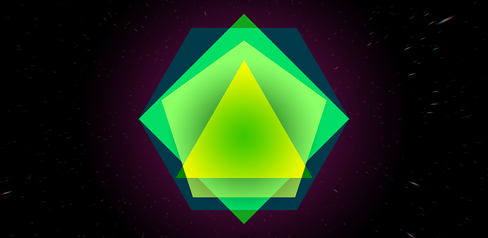

Shape Shifter is an Android game built with Unity3D in C#. The game was one of my personal projects during the summer of 2016. The project started off with brainstorming creating as many game concepts on a piece of paper. After thinking of many ideas, the most interesting looking games were put into Unity as a prototype game. The most entertaining prototype was a game where the player morphs a shape into a triangle, square, pentagon, or a hexagon to match edges which flies towards the shape. This game is now known as <i>Shape Shifter</i>.

<h2>Purpose</h2>

The purpose of this summer project is to

The Android game can be seen at the [Google Playstore](https://play.google.com/store/apps/details?id=com.Azuligno.ShapeShifter).

